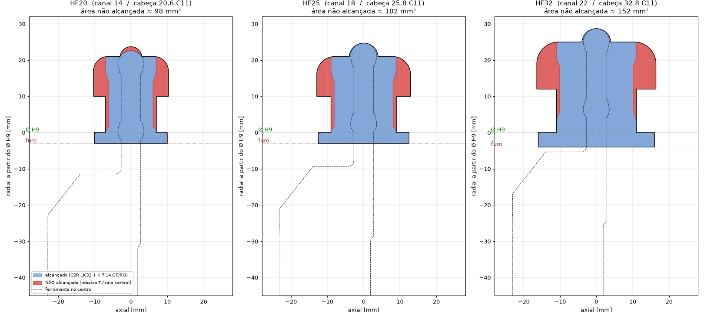
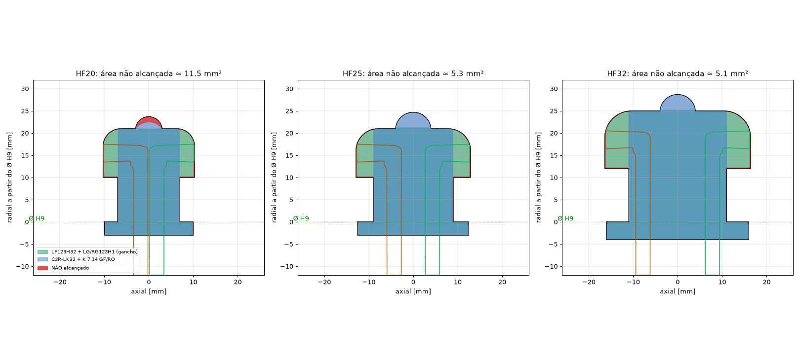

# Analysis: HF20 / HF25 / HF32 guide blade grooves (Siemens 0-2091-0054-xx), Mazak Mega Turn 1600

Status: **preliminary, rev. 2**. Covers assemblies 2 and 4 plus the LF123H32-25B1 blade with LG/RG123H1-0400-0004-GS inserts.

## Data taken from the STEP files (CoroPlus)

| Assembly | Holder | Insert | Measured from 3D |
|---|---|---|---|
| 4 | C2R-RS25-LK32DB | C2I-K2N-0714-0008-GF1225 | width 7.14, corner radius ≈ 0.8 |
| 2 | C2R-RS25-LK32DB | C2I-K2N-0714-RO 1225 | full radius R3.57 |

Holder geometry (relative to the insert tip):

- Blade width behind the insert: **5.35 mm**, insert 7.14 mm, so 0.9 mm per side of clearance.
- **Free length ≈ 33.3 mm**. From there the body widens toward the -X side (left-hand holder). The +X side is flush up to the shank.
- Tangential height of the blade/body: Y -31.9 … +10.2 mm. In the bore this costs depth: ≈ y²/Ø, i.e. ~1.3 mm at Ø800, ~0.85 mm at Ø1200, ~0.65 mm at Ø1600.

## Slot depths (read from the drawings)

Depths are measured from the Ø H9 line, with the mouth (3 or 4 mm) below it.

| Slot | Neck | T head | Head floor | Top of center radius | Total from the bore |
|---|---|---|---|---|---|
| HF20 | 14 H11 | 20.6 C11 | 21 | 10 + 13.7 = **23.7** (R3) | 26.7 |
| HF25 | 18 H11 | 25.8 C11 | 21 | 10 + 14.7 = **24.7** (R4) | 27.7 |
| HF32 | 22 H11 | 32.8 C11 | 25 | 12 + 16.7 = **28.7** (R4) | **32.7** |

## Result of the 2D simulation (tool profile vs. slot profile)

1. **Depth: OK on all three.** The C2R LK32 reaches the floor everywhere it can enter.
   - HF32 is the tight one: 33.3 available vs 32.7 needed, so **0.6 mm** margin before the bore curvature.
   - Below about Ø1300 the body touches the edge of the bore when the insert is on the left side of the neck. This confirms the need for the **LF123G33** (33) for HF32.
2. **HF20 center radius R3 (+0.1) is NOT made with K 7.14 inserts.**
   - The bump is 6 mm wide and the RO has R3.57 > R3.1, so the max depth reached is 22.6 vs 23.7 needed.
   - It has to be profiled with a 4 mm insert (G seat, e.g. RO 4.0 = R2.0) on the LF123G33 blade.
   - HF25 and HF32 (R4): the RO 3.57 reaches the top exactly (24.7 and 28.7). Finish by interpolating R4.
3. **The T undercut is not reached by any straight tool** (red area in the figure).
   - The blade has to pass through the neck, so the insert gets at most 0.9 mm beyond the neck wall.
   - Missing per side: HF20 ≈ 3.3 mm, HF25 ≈ 3.9 mm, HF32 ≈ 5.4 mm, plus the R4/R5/R6 corners, the R0.5 corners and the 1x45°.
   - The LF123 blades with LG/RG123 inserts are straight too, so they don't solve it.
   - They work for **detail X (Design 2, R0.4 max, relief 0.9 × 0.2)** at the mouth.
   - **A hook tool (left and right) is needed for the undercut.** Resolved in rev. 2 by the LG/RG123H1.
4. Quote: the LF123H32-25B1 / LF123G33-25B1 blades need a **blade holder** (25 mm blade height). It isn't in quote I9_26-21080.

## Open items

- Real diameter of the bore / slots (for the curvature correction).
- STEP files of the LF123G33 + C2I-G2N assembly and of the blade holder. Confirm the blade thickness.

## Rev. 2: LF123H32-25B1 + LG123H1 / RG123H1-0400-0004-GS (hook)

Geometry from the STEP files:

- The insert is L-shaped: a 3.2 mm shank, and a hook that sticks out **6.8 mm** sideways (LG to one side, RG to the other).
- Cutting width 4 mm (radial), rε 0.4.
- Total width at the hook is 10.0 mm, so it passes through the 14 / 18 / 22 necks.
- Hook reach beyond the neck wall is 6.8 mm. Needed: 3.3 / 3.9 / 5.4. **OK on all three.**
- Radial depth needed for the hook (head floor, from the bore) is 24 / 24 / 29 against the blade's CDX 32. **OK.** HF32 has 3 mm of margin.
- rε 0.4 is at most R0.5 (lower corners) and at most R0.4 (detail X Design 2). **OK.**

Combined simulation, in `alcance_conjunto.png`:

- Only slivers under 0.1 mm remain on the walls and corners. That's the simulation's step size.
- **Real leftover: the HF20 R3 center radius.** Neither the K 7.14 nor the hook gets in there, so it needs the 4 mm G insert on the LF123G33.
- Assumption: blade thickness at most 3.2 mm (the insert shank). Check against the catalog.

## Proposed sequence (per slot)

| Op | Tool | What it does |
|---|---|---|
| 10 | C2R-LK32 + K2N-0714-0008-GF | Open the mouth (H8) and neck. Plunge in steps of about 6.5 mm down to the head floor. Leave 0.2–0.3 mm on the walls. |
| 20 | LF123H32 + RG123H1 | Rough the left undercut. Enter through the neck, then move axially in radial bands of at most 3.5 mm. Leave allowance. |
| 30 | LF123H32 + LG123H1 | Rough the right undercut (mirror of op 20). |
| 40 | RG / LG | Finish the head: C11 wall, R4/R5/R6, R0.5 at the lip underside (back-cut), 1x45°, floor at the sides. |
| 50 | C2R-LK32 + K2N-0714-RO | Center radius R4 (HF25 / HF32) and the floor in the center region. |
| 55 | LF123G33 + C2I-G2N-0400 (radius) | HF20 R3 center radius, by interpolation. Also the HF32 depth, if the C2R touches the bore edge. |
| 60 | C2R-LK32 + K2N-0714-0008-GF | Finish the neck walls (H11) and the mouth (H8). |
| 70 | LF123H32 + LG/RG | Detail X, Design 2 (relief 0.9 × 0.2, R0.4). |

Cutting notes for the hook:

- The cutting edge is offset 6.8 mm from the blade axis, so the cutting force twists the blade.
- Use a low feed on the axial move (f ≈ 0.05–0.08 mm/rev to start) and stable Vc.
- Check chip evacuation inside the head. Use high-pressure coolant if the machine has it.
